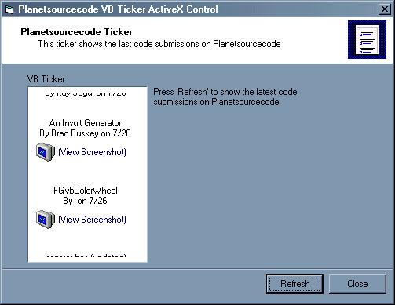



## Planetsourcecode Code Ticker ActiveX

### Description

This ActiveX Control show you the latest code submissions on Planetsourcecode, like the Ticker on the left hand side.
 
### More Info
 

             |
---                |---
**Submitted On**   |2000-07-26 18:23:00
**By**             |[Dirk Hottes](https://github.com/Planet-Source-Code/PSCIndex/blob/master/ByAuthor/dirk-hottes.md)
**Level**          |Advanced
**User Rating**    |4.4 (31 globes from 7 users)
**Compatibility**  |VB 6\.0
**Category**       |[OLE/ COM/ DCOM/ Active\-X](https://github.com/Planet-Source-Code/PSCIndex/blob/master/ByCategory/ole-com-dcom-active-x__1-29.md)
**World**          |[Visual Basic](https://github.com/Planet-Source-Code/PSCIndex/blob/master/ByWorld/visual-basic.md)
**Archive File**   |[CODE\_UPLOAD81977262000\.zip](https://github.com/Planet-Source-Code/dirk-hottes-planetsourcecode-code-ticker-activex__1-10093/archive/master.zip)

